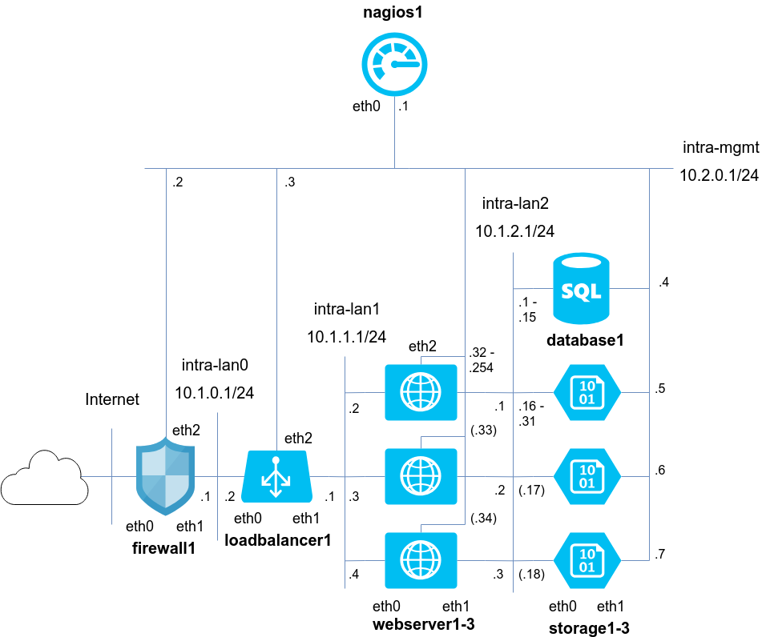

# CDPS - Práctica Final
#### Pablo Caraballo Llorente + Mario Penavades Suárez

Este proyecto integra los conocimientos adquiridos a lo largo de la asignatura relativos a virtualización, almacenaje de datos replicado y demás competencias necesarias en un centro de datos.
Se proporcionan dos métodos a evaluar:

 1. Realización de los **requisitos básicos** del programa.
 2. Realización de un **método automático estilo Dockerfile/Docker-Compose** que maneja y levanta redes virtuales de manera dinámica.

## Uso

A continuación se muestra una pequeña guía de uso del mecanismo implementado en la mejora. 

El mecanismo se puede analizar como una estructura de 3 componentes:

### `lxc-setup.sh`

Es el fichero que se encarga de ejecutar el escenario para esta práctica. Necesita ser ejecutado como `root` ya que utiliza comandos red que lo requieren, y ha de ejecutarse desde la carpeta `bin/`.

En primer lugar este fichero hará un control sobre las dependencias mínimas necesarias para poder ejecutar la práctica:

 - `net-tools`: para poder usar ifconfig
 - `bridge-utils`: para poder crear bridges virtuales que separen las redes de los contenedores  

Tras ello, hará un segundo control de paquetes de python:

 - `pybrctl`: paquete para poder efectuar directivas de `brctl` desde python
 - `pyyaml`: paquete para poder tratar ficheros yaml en python

Después generará el entorno de red que se pide en la práctica, con modificaciones de notación que no afectan de manera alguna al comportamiento. Para ello, ejecutará, por cada tipo de servicio distinto que ha de existir, el programa en python `lxc-setup.py` (su funcionamiento se explica en el siguiente apartado).

Para usarlo sólo habrá que hacer:

  `sudo ./lxc-python.sh`
_**Nota**: se asume que la versión instalada de python es la 2.7 y que tanto lxc como lxd están instalados en el sistema host._  

### `lxc-setup.py`  

Este será el script que configure cada máquina. En el fichero anterior, se llama a este script tantas veces como máquinas de categoría distinta hay, es decir, firewall, balanceador, webservers, almacenamiento y BBDD. Se encarga de instalar y configurar todos los parámetros indicados en el `config-file.json` de cada clase.

El uso de este script es del modo:

`python ./lxc-setup.py [config-file.json]`

Para la praáctica se ha configurado el `lxc-setup.sh` para que instale el escenario base de la práctica junto con todas las mejoras implementadas, a excepción del cuarto servidor web, ya que la intención es levantarlo con el profesor delante.

### `[name]-cfg.json (config-file.json)`

Se trata del fichero que describe al contenedor que se desea crear. Tiene un mecanismo similar al Dockerfile, en conjunto con el Docker-Compose. En él se definirán los siguientes campos:

 - `image`: String, se trata de la imagen lxc que va a usar, del modo `[\<remote\>]:\<image\>`
 - `name`: String, será el nombre que se le de al contenedor. Nótese que los contenedores acaban siempre en un número que los identifica de las réplicas.
 - `dependencies`: [String], aquellos programas que necesitemos presentes en el conetenedor
 - `interfaces`: [{name: String, network: String, address: String, gateway4: String}], configuración personalizada sobre las interfaces de red: 
	  1.  `name` será el nombre de la interfaz (eth0, eno1...)
	  2. `network` indica a qué red queremos conectarla (intra-lan0...)
	  3. `address` será la dirección IP que queremos en el contenedor, tipo CIDR `(AA.AA.AA.AA/MM)`
	  4. `gateway`en caso de utilizar gateway con IPv4
- `forwarding`: Boolean, si queremos que el contenedor reenvie paquetes IP
- `run`: [String], al igual que en Docker son comandos que se ejecutan antes de finalizar la instalación **en cada contenedor del config-file**
- `cmd`: [String], son comandos que se ejecutan _on boot_ del contenedor. `lxc-setup.py` se encarga de generar un fichero en shell con la colección de comandos y de importarlo en `/etc/init.d/` para ello. **Se hace para todos los contenedores del config-file**
- `env`: {String: String}, variables de entorno que se agregarán al `.bashrc` en orden de que siempre estén presentes. **Se agregan a todos los contenedores del config-file**
- `scripts`: [String], se trata de scripts shell literales que se ejecutarán tras la instalación del config-file. Esto nace de la necesidad de particularizar ciertos comandos **a algún componente de la réplica en vez de todos**.
- `replication`: Int, número de réplicas. **Tanto si es 0, como 1, como si no existe, se genera un solo contenedor cuyo nombre final será `[name]1`** 
- `nagios`: Boolean, en caso de que queramos que dicho set de contenedores esté monitorizado por uno de mantenimiento mediante nagios. **Para esto, ha de crearse primero el contenedor nagios**

Para más info sobre estos ficheros se puede consultar cada uno particular en cada carpeta de componente, o la plantilla explicatoria en config-file.
